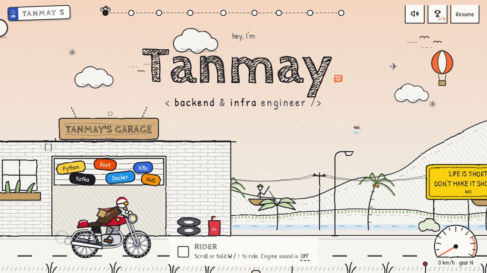
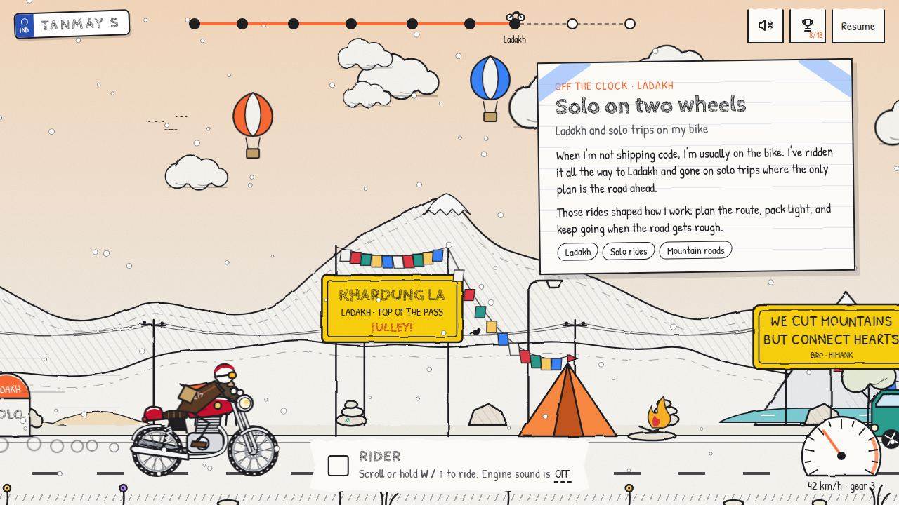
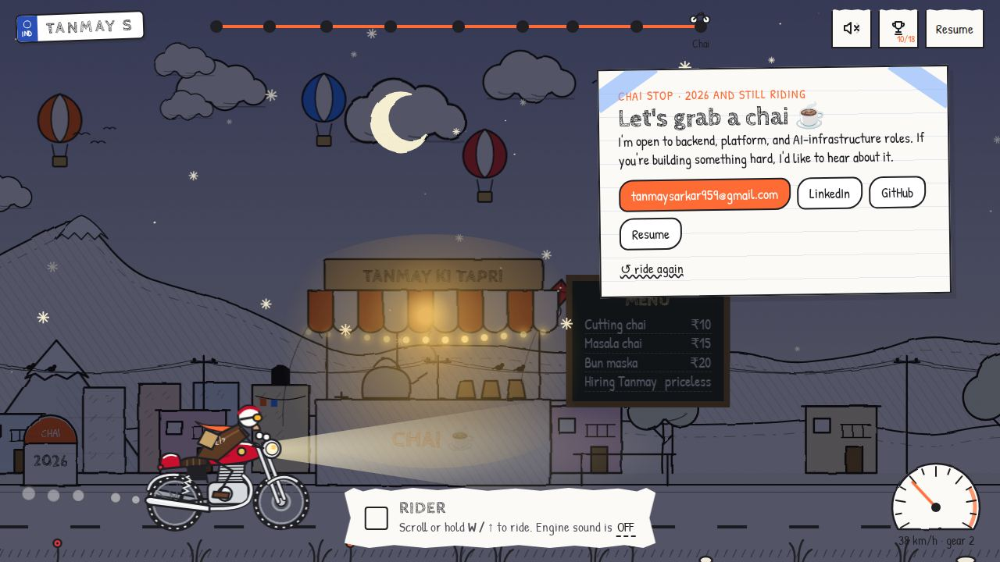

# The Ride — Tanmay Sarkar's portfolio

A hand-drawn, scroll-driven motorbike ride through my journey as a backend and infrastructure engineer.

**Live:** [tanmaysarkar.dev](https://tanmaysarkar.dev)



Instead of a list of jobs, you kick-start a café racer and ride across India, from school in Malda to my current role in Jaipur, with a solo detour to Ladakh. Each stop is a notebook page taped into the scene.

## The route

| Stop | Year | What's there |
| --- | --- | --- |
| Tanmay's Garage | — | Start line, tech stickers on the shutter |
| Malda, West Bengal | 2019 | Kendriya Vidyalaya, mango groves, a river with fishing boats |
| Gwalior | 2020 | RIT: clock tower, ECE lab with blinking LEDs, tossed grad caps |
| Pune | 2023 | Solytics Partners, monsoon rain, a vada pav cart |
| Jaipur | 2024 | IzooLogic, a Hawa Mahal-style facade, dunes, kites, a camel |
| Pit stop | — | Skills, served as fuel pumps (PY-98, RUST, K8S) |
| Ladakh | — | Solo rides: Khardung La, prayer flags, a campfire, snowfall |
| Washing line | — | Projects pegged above the road; click one to open its code |
| Chai stop | 2026 | Contact details, at night, under fairy lights |



## Things to try

- **Ride** by scrolling or swiping, or hold `W` / `↑` / `Space`. Hold `Shift` to go faster.
- **Kick-start with sound** on the intro screen to hear the engine, then click the bike to honk.
- **Stop for a few seconds** and the rider starts thinking out loud, mostly in BRO road-sign slogans.
- **Read the roadside**: yellow signs carry real Border Roads Organisation slogans, with a few classic quotes on wooden boards.
- **Collect achievements** with the 🏆 button. Some of them are hidden.

<details>
<summary>Hidden achievements (spoilers)</summary>

- Honk while the cow is mooing.
- Ride backwards past the school.
- Type `sudo ride` for eight seconds of turbo.
- Click the moon at night.
- Stop long enough for the rider to think.

</details>



## How it's built

No framework, no build step, no runtime dependencies. One HTML page, one script and one stylesheet.

- **Scenery** is SVG generated in the browser from seeded random numbers, so it's identical on every visit. A shared SVG turbulence filter gives the lines their hand-drawn wobble.
- **Parallax**: six layers (clouds, far hills, mid hills, near trees, ground, foreground grass) move at different speeds against the rider's position.
- **Day to night**: the sky wash, sun, moon, stars, lamp glows and headlight are all driven by how far along the route you are.
- **Weather** (rain, dust, snow) is drawn on a canvas layer, only inside its region.
- **Engine sound** is synthesised with the Web Audio API: detuned sawtooth oscillators and a sine sub-bass through a soft clipper. No audio files.
- **Achievements** are saved in `localStorage`, so they persist between visits in the same browser.
- **Fonts** (Cabin Sketch and Patrick Hand, both OFL) are self-hosted.
- **Accessibility**: it works on phones down to 360px, respects `prefers-reduced-motion`, and the content still renders as plain notes without JavaScript.

## Project structure

```
index.html          Page shell, HUD, intro screen and every stop's note card
ride/ride.js        The ride: scenery, rider, traffic, weather, sound, achievements
ride/style.css      Sketchbook styling and the mobile layout
ride/fonts/         Self-hosted woff2 fonts
favicon.svg         Tab icon (plus favicon-32.png and apple-touch-icon.png)
docs/               Screenshots used in this README
CNAME               Custom domain for GitHub Pages
.github/workflows/  Deploys the site to GitHub Pages
```

## Run it locally

Any static file server works:

```bash
python3 -m http.server 8000
# open http://localhost:8000
```

Opening `index.html` straight from disk also works, but some browsers block the self-hosted fonts over `file://`.

## Editing the content

- **Text on each stop:** the `<article class="card" data-cp="…">` blocks in `index.html`.
- **Where stops sit on the road:** `CHECKPOINTS` at the top of `ride/ride.js`. The `id` must match a card's `data-cp`.
- **Projects on the washing line:** `POSTERS` in `ride/ride.js`.
- **Roadside signs and quote boards:** `ROADSIDE` in `ride/ride.js`.
- **Thought-bubble quotes:** `THOUGHTS` in `ride/ride.js`.
- **Achievements:** `ACHIEVEMENTS` in `ride/ride.js`. A fourth value of `true` keeps one hidden until it's found.
- **Resume link:** the two Google Drive links in `index.html`.

## Deployment

Every push to `main` runs `.github/workflows/static.yml`, which publishes the repository to GitHub Pages. `CNAME` points it at tanmaysarkar.dev.

## Credits

- Fonts: [Cabin Sketch](https://fonts.google.com/specimen/Cabin+Sketch) and [Patrick Hand](https://fonts.google.com/specimen/Patrick+Hand), SIL Open Font License.
- Road-sign slogans: India's [Border Roads Organisation](https://en.wikipedia.org/wiki/Border_Roads_Organisation), including Project Himank in Ladakh.
- Inspired by the hand-drawn feel of [itomdev.com](https://itomdev.com).

## Contact

- Email: tanmaysarkar959@gmail.com
- GitHub: [Tanmaysarkar2002](https://github.com/Tanmaysarkar2002)
- LinkedIn: [tanmay-sarkar](https://www.linkedin.com/in/tanmay-sarkar-716bb4156/)
